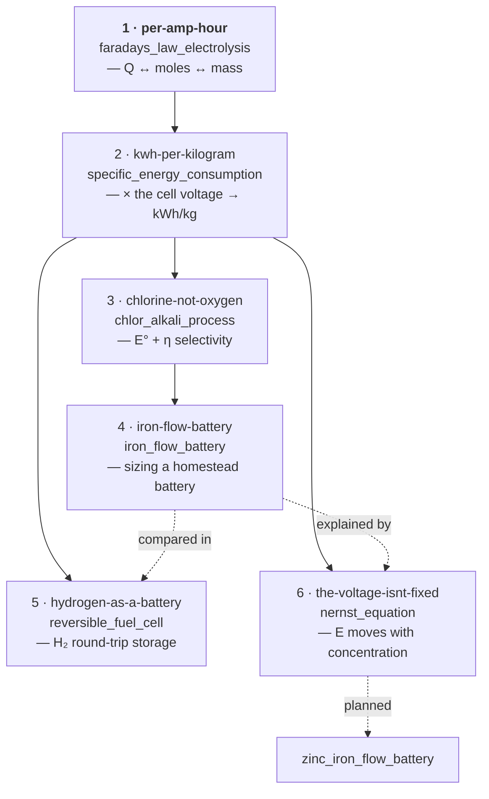

# Electrochemistry — Tutorial Sequence

Interactive walk-throughs built from the
[`chemistry-electrochemistry`](../SKILL.md) capsule with the
[`formula-tree-tutorial`](../../formula-tree-tutorial/SKILL.md) skill. Each is
plain Markdown that runs under [`upmd`](https://upmd.dev): you execute every
check yourself. The chemistry, the prerequisite order, and every number come
from the capsule.

Run one from the repository root, e.g.
`upmd skills/chemistry-electrochemistry/tutorial/per-amp-hour.md`, or run every
block with `upmd --ci --all <file>`.

## Recommended order



1. **`per-amp-hour`** (`faradays_law_electrolysis`) — the charge/electron/mass
   bookkeeping: `Q = I t`, the electron count `z`, `m = I t M / (z F)`, product
   gas volume, current efficiency. Capstone sizes a hydrogen electrolyser
   (~26.6 kA·h per kg H₂). **Start here** — everything else assumes it.
2. **`kwh-per-kilogram`** (`specific_energy_consumption`) — multiplies the
   charge by the cell voltage. `E°_cell`, `ΔG = −zFE`, overpotential, the ohmic
   drop, `V_cell = E°_cell + Σ|η| + IR`, then `E_spec = zF V_cell / (M η_F)`.
   Capstone compares hydrogen (~54 kWh/kg) with aluminium (~13 kWh/kg).
3. **`chlorine-not-oxygen`** (`chlor_alkali_process`) — uses #1 and #2. Competing
   anode reactions, and why comparing the **effective** potentials `E° + η`
   (not `E°` alone) explains a whole industry: the `0.5 V` oxygen overpotential
   beats chlorine's `0.13 V` `E°` disadvantage. Capstone sizes a 15 kA cell line.
4. **`iron-flow-battery`** (`iron_flow_battery`) — uses #1–#3. The flow-battery
   architecture (energy in the tanks, power in the stack), the three
   efficiencies, and why **all-iron** — not vanadium — is the homestead
   chemistry. Capstone sizes a 20 kWh / 4 kW off-grid battery (two IBC totes of
   FeCl₂, ~4.35 m² of stack).
5. **`hydrogen-as-a-battery`** (`reversible_fuel_cell`) — uses #1, #2, #4.
   Water electrolysis and its reverse: `1.23 V` reversible vs `1.48 V`
   thermoneutral, the oxygen overpotential paid **both ways**, and why the
   hydrogen round trip is only `~31 %`. Capstone compares hydrogen storage
   (tiny cylinder, terrible round trip → *seasonal*) with the iron flow battery
   (big tanks, good round trip → *daily*).
6. **`the-voltage-isnt-fixed`** (`nernst_equation`) — uses #1, #2, #4. `E = E° −
   (RT/zF) ln Q`: the reaction quotient, the `59.16/z` mV-per-decade form (the
   pH-meter slope), a battery built from a concentration difference alone, and
   why the open-circuit voltage sags as a cell discharges. Capstone derives the
   `~80 %` usable SOC window that tutorial #4 hand-waved.

## The tutorials

| # | tutorial | target node | blocks | checks |
|---|---|---|---|---|
| 1 | [`per-amp-hour`](per-amp-hour.md) | `faradays_law_electrolysis` | 11 | 4 dimensional, 3 numeric, 2 Lean, capstone |
| 2 | [`kwh-per-kilogram`](kwh-per-kilogram.md) | `specific_energy_consumption` | 11 | 4 dimensional, 4 numeric, 3 Lean, capstone |
| 3 | [`chlorine-not-oxygen`](chlorine-not-oxygen.md) | `chlor_alkali_process` | 9 | 6 numeric, 2 Lean, capstone (selectivity — qualitative, no dimensional check) |
| 4 | [`iron-flow-battery`](iron-flow-battery.md) | `iron_flow_battery` | 11 | 3 dimensional, 5 numeric, 3 Lean, capstone |
| 5 | [`hydrogen-as-a-battery`](hydrogen-as-a-battery.md) | `reversible_fuel_cell` | 9 | 1 dimensional, 4 numeric, 2 Lean, capstone |
| 6 | [`the-voltage-isnt-fixed`](the-voltage-isnt-fixed.md) | `nernst_equation` | 9 | 1 dimensional, 4 numeric, 2 Lean, capstone |

"Dimensional" = a `[M L T Θ N I]` 6-tuple check printing `0 0 0 0 0 0`.
"Lean" = a `bash` block that heredocs the capsule's exact
`validation/derivation-checks.lean` instance, runs `lean`, and `SKIP`s cleanly
if `lean` is absent.

## What the reader needs

| tutorial | assumed background |
|---|---|
| 1 | electric charge (conserved, coulombs) and current (`I = dQ/dt`); the mole, molar mass, and half-reaction balancing from `chemistry-foundations` |
| 2 | tutorial #1; electric potential (`W = QΔV`), Ohm's law; Gibbs free energy and `ΔG° = −RT ln K` (imported) |
| 3 | tutorials #1 and #2; standard reduction potentials as reduction potentials vs SHE |
| 4 | tutorials #1–#3; a rough sense of grams-vs-kWh scale for off-grid storage |
| 5 | tutorials #1, #2, #4; the difference between daily and seasonal storage |
| 6 | tutorials #1, #2, #4; logarithms, and Q / K from chemistry-foundations |

All work at **298.15 K** in the **`dilute_ideal_solution`** limit, and stop
where the capsule stops (Butler–Volmer stated not derived; no double layer, no
photo-electrochemistry, no corrosion engineering).

## Planned

From `../indexes/prerequisite-paths.md`: `zinc_iron_flow_battery` (the
higher-voltage low-toxicity flow chemistry) is the last staged cut.

## Verifying the set

```sh
for f in skills/chemistry-electrochemistry/tutorial/*.md; do
  case "$f" in */README.md) continue;; esac
  printf '%s: ' "$f"
  upmd --ci --all "$f" >/dev/null 2>&1 && echo OK || echo FAIL
done
```
