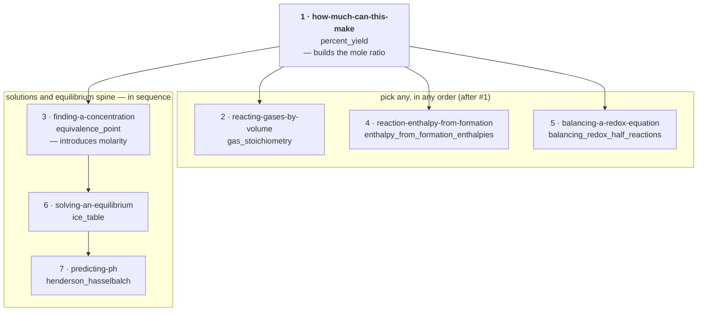

# Chemistry Foundations — Tutorial Sequence

Seven interactive walk-throughs built from the
[`chemistry-foundations`](../SKILL.md) capsule with the
[`formula-tree-tutorial`](../../formula-tree-tutorial/SKILL.md) skill. Each is
plain Markdown that runs under [`upmd`](https://upmd.dev): you execute every
check yourself and watch it pass. The chemistry, the prerequisite order, and
every number come from the capsule — the tutorials add no new claims.

Run one from the repository root, e.g.
`upmd skills/chemistry-foundations/tutorial/how-much-can-this-make.md`, or run
every block top-to-bottom with `upmd --ci --all <file>`.

## Recommended order



Every box maps to a row in [The seven tutorials](#the-seven-tutorials) table
below, which links to each file.

1. **Start with `how-much-can-this-make`** (target `percent_yield`). It builds
   relative atomic mass → molar mass → balancing → the **mole ratio** →
   limiting reagent → yield. Everything else assumes the mole ratio.
2. **Then branch by interest** — `reacting-gases-by-volume`,
   `reaction-enthalpy-from-formation`, and `balancing-a-redox-equation` are
   independent of each other. Each needs only #1 (a balanced equation and the
   mole ratio).
3. **The solutions-and-equilibrium spine is ordered:**
   `finding-a-concentration` (introduces `molarity`) → `solving-an-equilibrium`
   (the ICE table) → `predicting-ph` (which uses that ICE table directly).
   Do these three in sequence.

## The seven tutorials

| # | tutorial | capsule region | target node | blocks | checks |
|---|---|---|---|---|---|
| 1 | [`how-much-can-this-make`](how-much-can-this-make.md) | mole / stoichiometry | `percent_yield` | 13 | 3 dimensional, 4 numeric, 2 Lean, capstone |
| 2 | [`reacting-gases-by-volume`](reacting-gases-by-volume.md) | gases | `gas_stoichiometry` | 8 | 4 dimensional, 3 numeric, capstone |
| 3 | [`finding-a-concentration`](finding-a-concentration.md) | solutions | `equivalence_point` | 7 | 3 dimensional, 4 numeric, capstone |
| 4 | [`reaction-enthalpy-from-formation`](reaction-enthalpy-from-formation.md) | thermochemistry | `enthalpy_from_formation_enthalpies` | 11 | 4 dimensional, 3 numeric, 2 Lean, capstone |
| 5 | [`balancing-a-redox-equation`](balancing-a-redox-equation.md) | redox | `balancing_redox_half_reactions` | 8 | 5 numeric, 2 Lean, capstone |
| 6 | [`solving-an-equilibrium`](solving-an-equilibrium.md) | equilibrium | `ice_table` | 8 | 6 numeric (K/Q are dimensionless), capstone |
| 7 | [`predicting-ph`](predicting-ph.md) | acid–base | `henderson_hasselbalch` | 10 | 6 numeric, 2 Lean, capstone |

"Dimensional" = a `[M L T Θ N]` exponent check printing `0 0 0 0 0`.
"Lean" = a `bash` block that heredocs the capsule's exact
`validation/derivation-checks.lean` instance, runs `lean`, and `SKIP`s cleanly
if `lean` is not installed.

## What the reader needs (not what the capsule needs)

| tutorial | assumed background |
|---|---|
| 1, 2, 3, 5 | high-school algebra, ratios, unit conversion |
| 4 | + energy as a state quantity; the first law `ΔU = q − w` in words |
| 6 | + the quadratic formula; comfort with "solve, then verify by back-substitution" |
| 7 | + tutorial #6 completed; logarithm identities |

Every tutorial names the **regime** it works in — `ideal_gas` for #2,
`dilute_ideal_solution` for #6 and #7 — and stops where the capsule stops
(Release 0.1: no kinetics, electrochemistry, colligative properties, or orbital
bonding).

## Coverage

| capsule domain | covered by |
|---|---|
| atomic structure, the mole, stoichiometry | #1 |
| gases | #2 |
| solutions | #3 |
| thermochemistry | #4 |
| redox (balancing) | #5 |
| chemical equilibrium | #6 |
| acids and bases | #7 |
| qualitative bonding (feeder nodes) | — (qualitative; no runnable content) |

Not yet cut into a tutorial: `reaction_isotherm` (`ΔG° = −RT ln K`) — it
overlaps #4's imported-thermodynamics material; and the bond-enthalpy route to
`ΔH_rxn`, which fits better as an appendix to #4 than as its own document.

## Verifying the set

Every tutorial passes `upmd --ci --all`, and in each one the capstone plus at
least one middle check (and any Lean beat) run standalone via
`upmd --ci -b <block> <file>`. To check all seven at once:

```sh
for f in skills/chemistry-foundations/tutorial/*.md; do
  case "$f" in */README.md) continue;; esac
  printf '%s: ' "$f"
  upmd --ci --all "$f" >/dev/null 2>&1 && echo OK || echo FAIL
done
```
